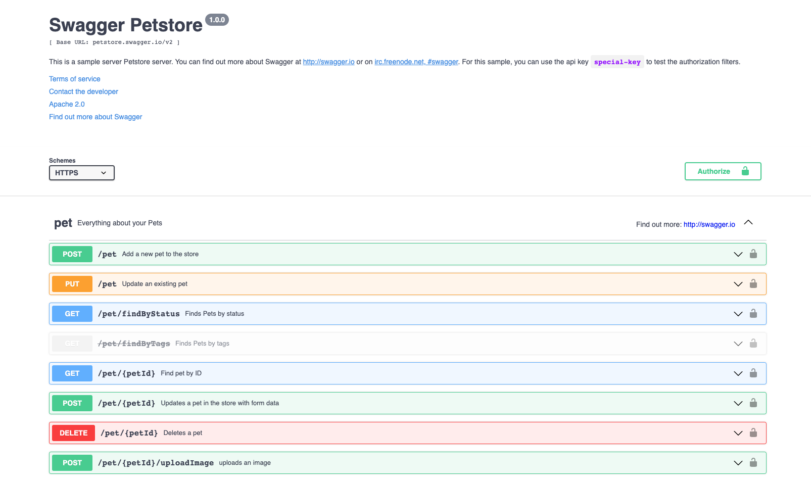
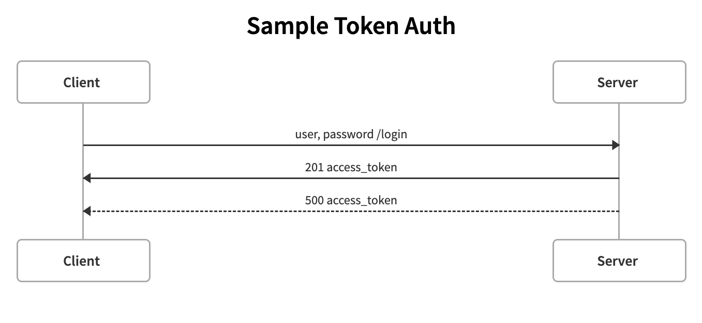

## PROJECT_NAME

*TODO: [ADD_TASK_REQUIREMENTS_HERE]*

By [Sophie Lewis](mailto:sophie@codewithdragos.com)

## Proposed Solution

*TODO: [ADD_SOLUTION_DESCRIPTION]*
- break down the steps you followed
- use bullet points to explain it in a very structured way

## Screenshots

## Sequence Diagrams

## Libraries / Tools Used

- Express.js for the http server
- Jest for testing
- ...

## Setup

To install the dependencies run:

`npm install`

And to run the app:

`npm start`

### Running the tests

#### Unit Tests

You can run the unit tests using:

`npm test`

#### Integration Tests

To run Cypress in interactive mode run:

`npm run cy:start`

